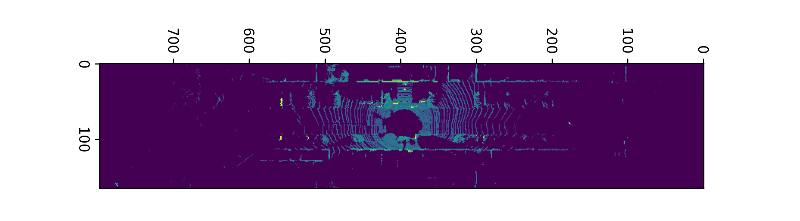
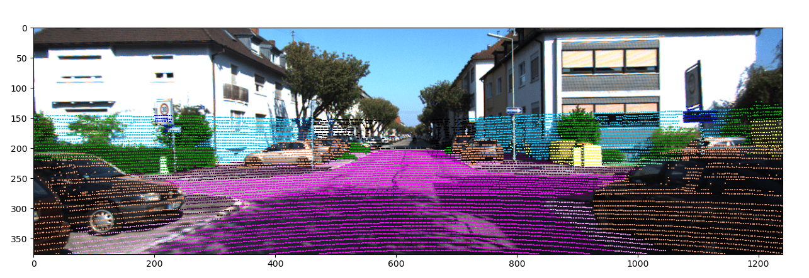
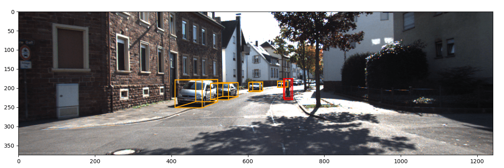
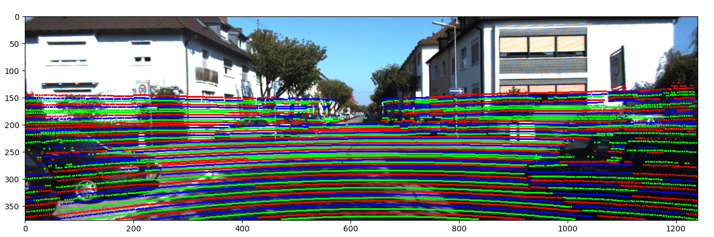
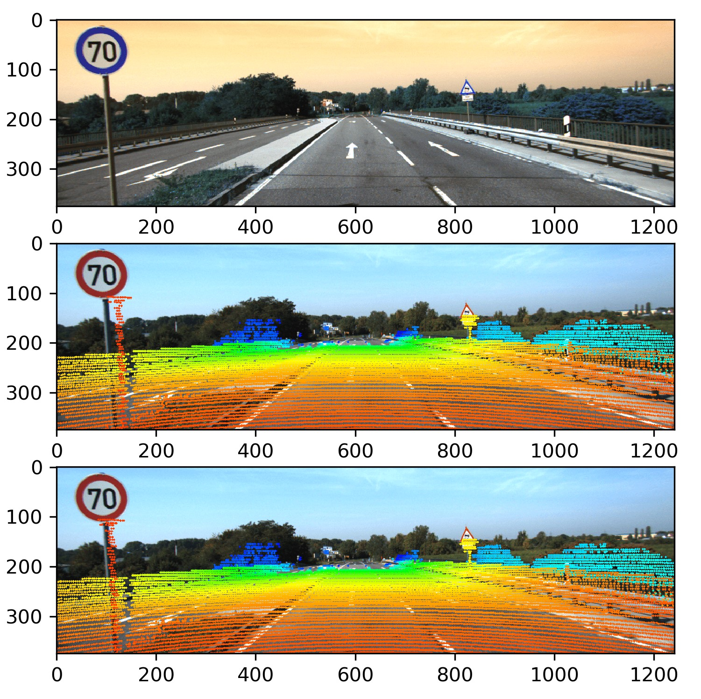

# Understanding Multimodel Driving Data
The repository dedicated for first project of the Deep Learning for Autonomous Driving course at ETH Zürich.

The fundamental goal of the project is to visualize the outputs of autonomous driving tasks such as 3D object detection and point cloud semantic segmentation given a LiDAR point cloud, the corresponding RGB camera image and the ground truth semantic labels.

### Tasks:
- **1.** Displaying Bird's Eye View with pixel intensities corresponding to the points' respective reflectance values.
- **2.a** Projecting the point cloud onto the image space.
- **2.b** Projecting 3D Bounding boxes of all given vehicles, cyclists and pedestrians of the given scene.
- **3.** Identifying the laser ID of each point in a given 3D point cloud.
- **4.** Removing motion distortion from LiDAR points caused by the vehicle motion with the aid of GPS/IMU data and projecting them to the image space.

### Respiratory Structure
- `data`: A directory containing the dataset.
- `figures`: A directory containing outputs of the tasks.
- `utils`: A directory containing utility functions.
- `notebooks`: A directory containing EDA and LDA visualization notebooks.

### Results
Here are the results of the tasks.

    
    

            <em>Task1: Birds' Eye View of the scene.</em>
    
    
    
    

            <em>Task2a: Projected colored point clouds with corresponding semantic labels.</em>
    
     
    
    

            <em>Task2b: Projected 3D Bounding boxes.</em>
    
     
    

    
     
    
    

            <em>Task3: Identified Laser IDs..</em>
    
   
    

        
        <em>Task4: Motion distortion removed point clouds.</em>

### License
This work is licensed under MIT License. Usage of the code in this repository is strictly prohibited.
